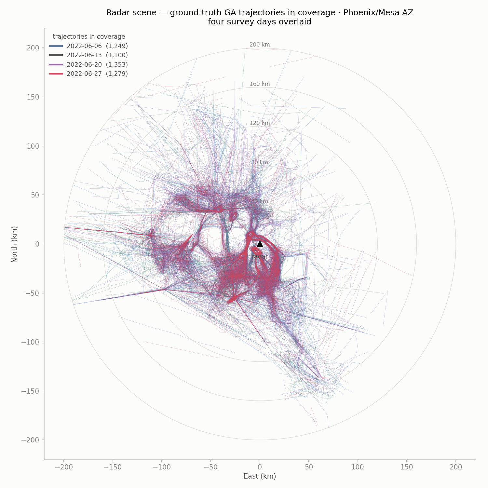
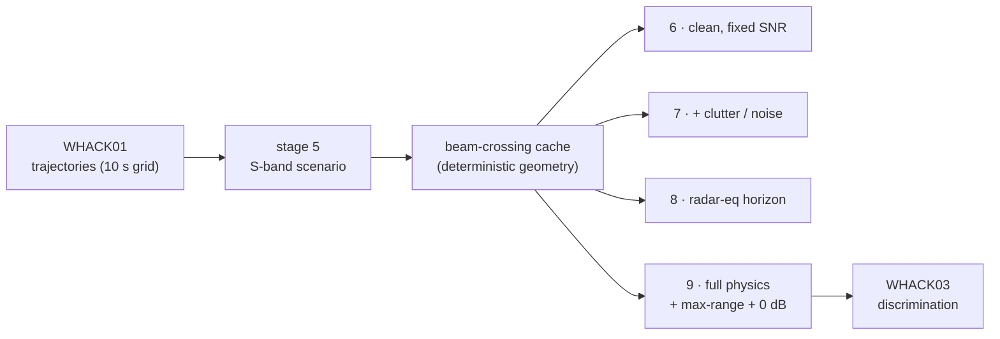
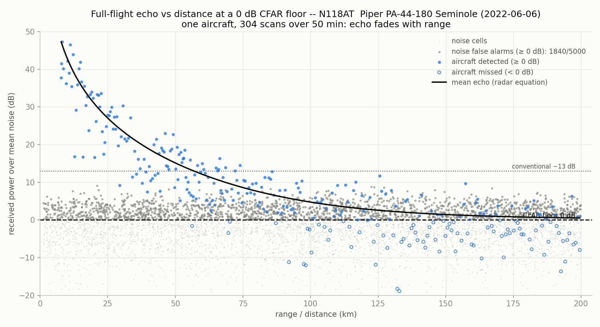
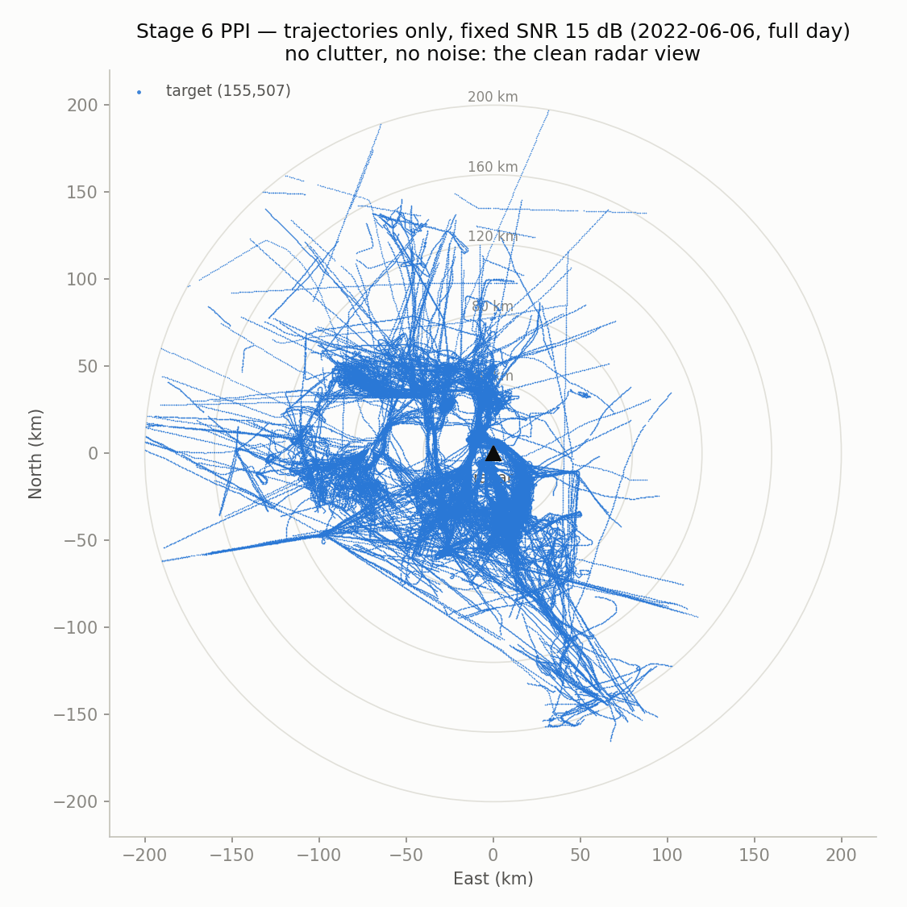
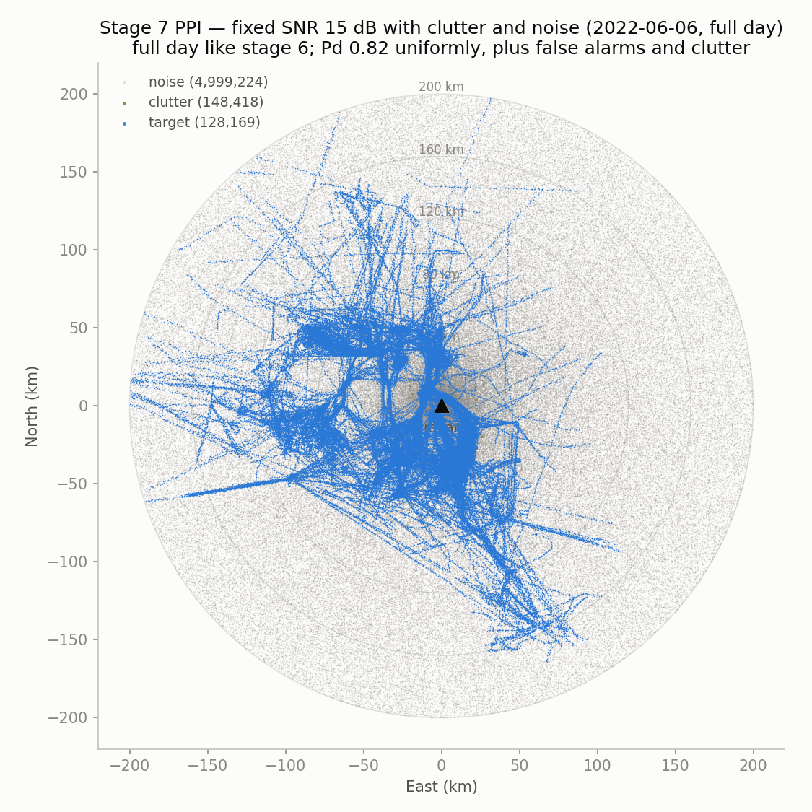
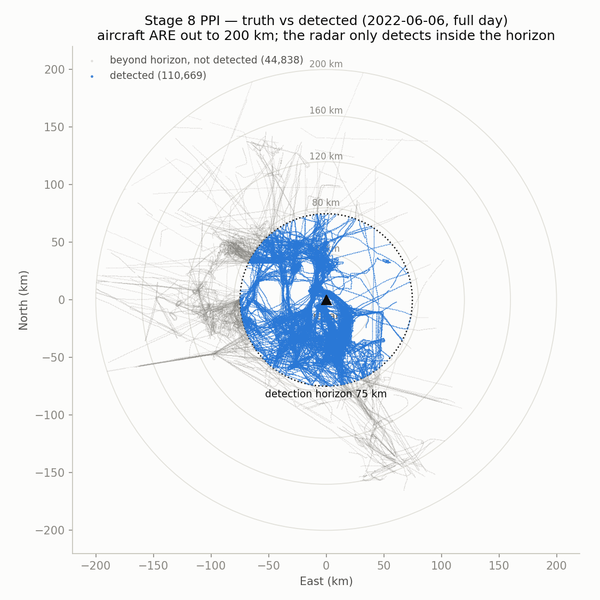
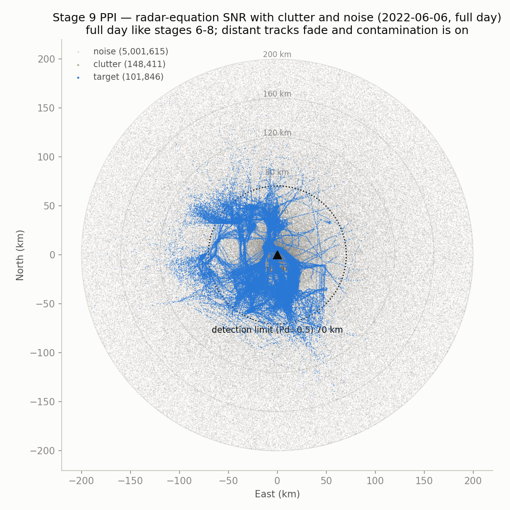
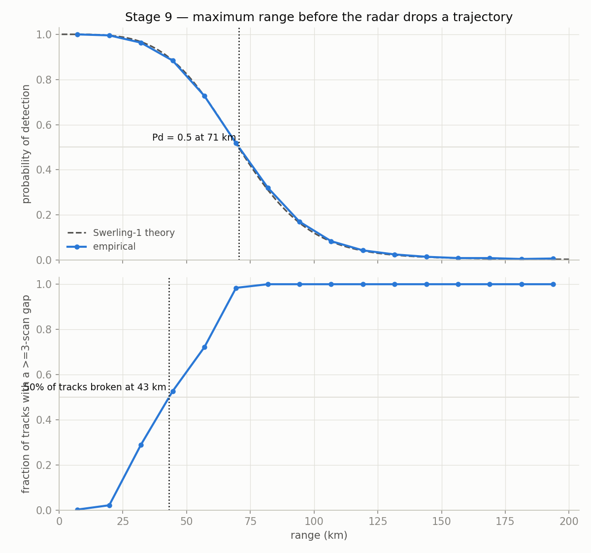
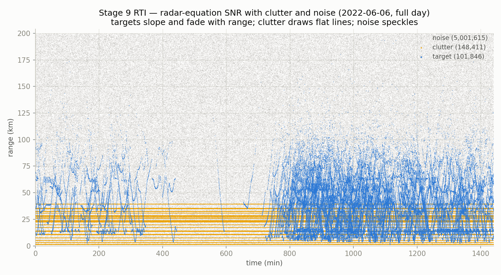
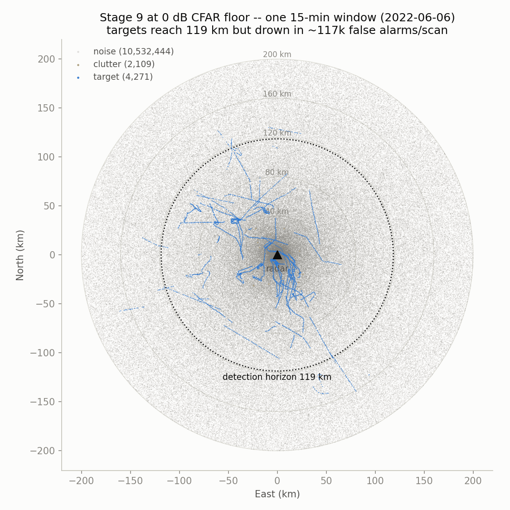

# WHACK02-Radar

### A 2D surveillance-radar measurement simulator over real aircraft trajectories

*S-band · fan-beam · Swerling-1 detection · derived link budget · Python (numpy · pandas · matplotlib)*

Built on the ground-truth conventional-GA trajectories from [WHACK01-Preprocessing](https://github.com/zheniannn/WHACK01-Preprocessing), this repo simulates what an S-band surveillance radar would actually measure — targets fading under the radar equation, Swerling fluctuation, false alarms, ground clutter — to study **track-based target-vs-clutter discrimination at low CFAR thresholds**.



> **At a glance** — a real 4-day, ~82k-trajectory GA dataset flown past one calibrated S-band radar:
> - **Detection horizon 74.8 km** (deterministic, from the radar equation) · **detection limit 70.5 km** · **tracking limit 43.1 km** (with fluctuation + clutter + noise)
> - Drop the CFAR floor 8 dB → 0 dB and range nearly doubles (**144 km**) — at **~117,000 false alarms/scan**. That trade is the whole motivation for track-based discrimination.
> - Every stage is a reproducible function of one frozen `scenario.json`; every stage self-validates against its closed form.

## The idea

Lowering a radar's CFAR threshold buys detection range but drowns the scope in false alarms. Single-scan detection can't tell a marginal target from noise — but **motion across scans can**. This repo generates the measurement datasets that make that case, via a progressive-complexity ladder where each stage adds exactly one effect, so every change in the figures has a single cause:

| Stage | SNR | Fluctuation | Meas. noise | False alarms | Clutter | Figures |
|---|---|:-:|:-:|:-:|:-:|---|
| 6 | fixed 15 dB | — | — | — | — | `4_*` |
| 7 | fixed 15 dB | ✓ | ✓ | ✓ | ✓ | `5_*` |
| 8 | radar equation (R⁻⁴) | — | — | — | — | `6_*` |
| 9 | radar equation (R⁻⁴) | ✓ | ✓ | ✓ | ✓ | `7_*`, `8_0db_*` |



## Quickstart

Python ≥ 3.9 with `numpy`, `pandas`, `matplotlib`:

```bash
pip install -r requirements.txt
```

Data root defaults to `data/` beside the repo (override with `WHACK_DATA_ROOT`); WHACK01's `active/trajectories_10s/` must be present. Then:

```bash
python scripts/05_radar_scenario.py             # freeze the radar into scenario.json
python scripts/06_trajectories_clean.py
python scripts/07_trajectories_cluttered.py
python scripts/08_trajectories_radar_equation.py
python scripts/09_radar_equation_cluttered.py
python scripts/radar_scene_days.py           # optional: per-day scene figures
```

Stage 5 builds a deterministic **beam-crossing cache** (when the rotating beam actually hits each aircraft, solved by fixed-point iteration); stages 6–9 share it, and a fingerprint sidecar recomputes it automatically if the scenario geometry changes. Every stage ends with a **validation gate** (Pd vs the Swerling-1 closed form, false-alarm rate within 5σ, measurement σs reproduced) that raises on failure.

## The radar (stage 5)

A 2D fan-beam **S-band** surveillance radar sited at the densest traffic cell in the data (Phoenix/Mesa, AZ): 2.8 GHz, 10 s scan, 1–200 km, 150 m × 1.5° cells, σ_range = 50 m, σ_az = 0.2°.

The 15 dB operating anchor is **derived from an explicit link budget, not asserted**: single-pulse SNR from `Pt·G²·λ²·σ / ((4π)³·R⁴·kT₀BF·L)` with stated hardware (15 kW, 34 dBi, B = 1 MHz from the range resolution, NF = 4 dB, solved system loss ≈ 9.3 dB) gives ~0 dB at 50 km for 1 m²; the PRF (749 Hz, unambiguous at 200 km) and beam dwell (41.7 ms) give **N ≈ 31 pulses/dwell** and a coherent integration gain of ≈ 15 dB. Detection statistics are Swerling-1: `Pfa(τ) = e^(−τ)`, `Pd = Pfa^(1/(1+SNR))`. Everything is frozen into `scenario.json` with the RNG seed — all later stages are reproducible functions of that file.

Stage 5 also renders data-derived detection figures from one real flight (N118AT, a Piper Seminole flying 8 → 200 km outbound). Dropping the CFAR floor from 8 dB to 0 dB keeps the fading echo "detectable" much farther out — but floods the scope with noise crossings (≈9 → ≈1,840 of 5,000 cells). The range-vs-false-alarm trade, on one real flight:

<table><tr>
<td width="50%" align="center"><b>8 dB CFAR floor</b><br></td>
<td width="50%" align="center"><b>0 dB CFAR floor</b><br></td>
</tr></table>


## The ladder, in figures

**Stage 6 — the trajectories alone.** Fixed 15 dB everywhere, nothing stochastic: the pure per-scan radar view (~1,250 trajectories in coverage per day).



**Stage 7 — add the contamination.** Same fixed SNR, plus Swerling fluctuation (Pd ≈ 0.82 uniformly), Gaussian measurement noise, ~579 Poisson false alarms/scan over the 318,240 CFAR cells, and 25 persistent clutter patches. Same tracks as stage 6 — now buried.



**Stage 8 — the range limit alone.** Radar-equation SNR, nothing stochastic: detection is deterministic, so the R⁻⁴ law draws a hard horizon at `R = range_ref·(snr_ref/τ)^(1/4)` ≈ **74.8 km**. Aircraft ARE out to 200 km (grey); the radar only detects inside the ring (blue).



**Stage 9 — full physics.** Distant targets fade (Pd ≈ 0.34 at 80 km), contamination on. The maximum-range analysis answers: how far can the radar still hold a trajectory?





- **Detection limit 70.5 km** (single-scan Pd = 0.5; closed form 70.3 km)
- **Tracking limit 43.1 km** (50 % of tracks broken by a ≥ 3-scan gap)

Both sit *inside* stage 8's deterministic 74.8 km horizon — **fluctuation, not the radar equation alone, is what actually breaks tracks.** The RTI is the classic discrimination view: targets slope with range rate, clutter draws dead-flat lines, noise speckles.



**The 0 dB experiment.** Drop the CFAR floor to 0 dB and the horizon jumps to 118.6 km (detection limit 144 km, tracking limit 82 km) — but at ~117,000 false alarms per scan (~10.5 M in this 15-minute window), single-scan detection is hopeless. This is the motivating figure for track-based discrimination ([WHACK03](https://github.com/zheniannn)):



All detections carry their measured `snr_db` down to the 8 dB recording floor, so any CFAR threshold ≥ the floor can be applied post-hoc by filtering — one dataset supports a full ROC sweep.

## Outputs (per stage, per day)

- `radar_truth_<date>.csv` — every beam crossing with measured SNR and detection outcome (the Pd denominator).
- `radar_detections_<date>.csv` — what a tracker sees: `scan_idx`, `t`, `range_m`, `azimuth_deg`, `snr_db`, `source` (`target`/`noise`/`clutter`), plus truth linkage for evaluation only.
- `measurements_summary.csv` (one row per day) and, for stage 9, `max_range_report.json`.
- Figures (full-day PPI + B-scope + RTI per stage, plus the analyses above) under `<data root>/plot/WHACK02-Radar/`.

## Repository layout

```
scripts/
├── 05_radar_scenario.py               # site + link budget -> scenario.json + real-flight figures
├── 06_trajectories_clean.py           # fixed SNR, clean
├── 07_trajectories_cluttered.py       # fixed SNR + contamination
├── 08_trajectories_radar_equation.py  # radar-equation SNR, clean (the horizon)
├── 09_radar_equation_cluttered.py     # full physics + max-range + 0 dB illustration
└── radar_scene_days.py                # ground-truth scene figures (auxiliary, un-numbered)
utils/
├── io.py                # all filesystem paths
├── geometry.py          # geodetic -> ENU -> range/azimuth/elevation
├── scenario.py          # the radar: link budget, waveform, Swerling-1 statistics
├── beam_crossings.py    # deterministic beam-crossing geometry (cached, shared by 6-9)
├── measurements.py      # MeasurementConfig + the stochastic measurement layer
└── plots.py             # shared PPI / B-scope / RTI / max-range figures
docs/figures/            # README images
```

## Data layout

```
<data root>/
├── active/
│   ├── trajectories_10s/      # WHACK01 stage 4 output (this repo's input)
│   └── radar/
│       ├── scenario.json      # stage 5 output (single source of truth)
│       ├── beam_crossings/    # deterministic geometry cache
│       └── stage06..09/       # per-day truth + detections per stage
└── plot/WHACK02-Radar/        # figures
```

## Extending

All radar physics live on the `Scenario` class (`utils/scenario.py`); geometry in `utils/beam_crossings.py`; the stochastic layer and per-stage recipes (`MeasurementConfig`) in `utils/measurements.py`. The scenario JSON is the single source of truth — edit it (or rerun stage 5 with `--range-max-km` / `--threshold-min-db` / `--seed`) and rerun stages 6–9. `--seed` on stages 7/9 re-rolls the stochastic layer (Monte Carlo) without recomputing geometry.
